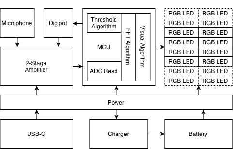
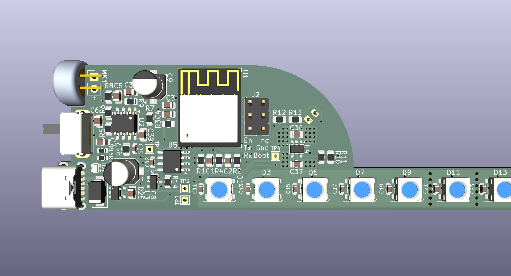
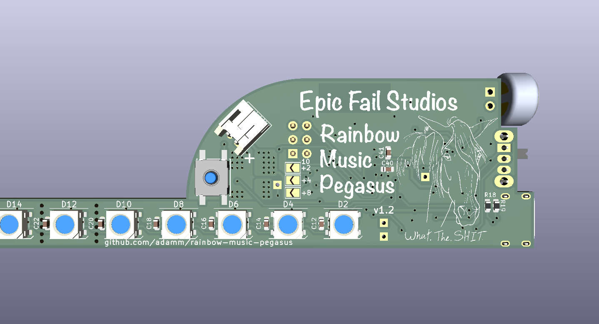
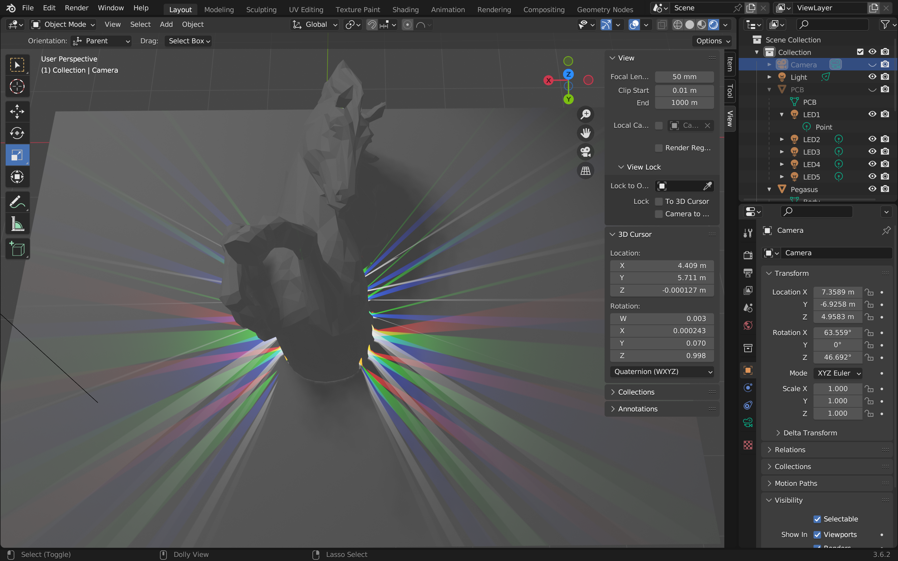

# Rainbow Music Pegasus

Disclaimer: This work is a *work-in-progress*.  This project is still under
active development and is estimated to be completed _Spring 2027_.
What you see here is code that is largely incomplete, buggy, probably crashes,
and could catch fire. The PCB board is largely inefficient, expensive,
probably broken, and could catch fire.

## History

Version 1 of the rainbow-music-pegasus was completed March 2024.  A few
test units were sold at Breyer West show, but were never mass produced.
v1 lacks wifi, bluetooth, and battery support.

Version 1.1 is under active development, after adding on a battery and
charger module, battery status lights, and adjusting the position of the
LEDs.  It is estimated to be completed Spring 2027.

## Description

Rainbow Music Pegasus is a combination 3D printed horse coupled with a PCB
with 10 or more RGB lights, microphone, and a MCU.  A
[Fast Fourier transform](https://en.wikipedia.org/wiki/Fast_Fourier_transform)
algorithm translates an audio signal from the microphone, which is displayed
as a flashing colour light display as the horse's wings.

The original design from the horse is from Stlflix, but its internals were
not adequate to support the PCB.  As a result I completely remapped all
vertices, and designed the internal mount to hold the PCB unit vertically.

## Design

The PCB features an ESP32-C3 MCU, a PUI Audio AOM-5024P-HD-MB-R electret
microphone, an OPA2322 dual amplifier with an MCP41050 digital potentiometer,
up to 24 WS2812B RGB LEDs, and an MCP73831 battery charging circuit.  The full schematic is in
[schematic.pdf](schematic.pdf) and the parts list is in [bom.csv](bom.csv).



[View on KiCanvas](https://kicanvas.org/?github=https%3A%2F%2Fgithub.com%2Fadamm%2Frainbow-music-pegasus%2Fblob%2Fmaster%2Fpcb%2Frainbow-music-pegasus.kicad_pro)







## Battery

Use a single-cell (3.7V nominal) LiPo of 400mAh or larger, connected to the
JST PH connector J3.  The MCP73831 charges at a fixed 200mA (set by R10 and
R11), which keeps the charge rate at or below 0.5C for a 400mAh cell.  Larger
batteries are fine but take longer to charge: roughly 4 hours for 800mAh and
10 hours for 2000mAh.

## Repository layout

| Path                 | Contents |
|----------------------|----------|
| [firmware/](firmware/) | ESP-IDF firmware for the ESP32-C3 (see its [README](firmware/README.md)) |
| [pcb/](pcb/)           | KiCad project, 3D models and gerbers |
| [stl/](stl/)           | Pegasus model (Blender, STL, 3MF), PCB model and SMT stencil mount (OpenSCAD) |
| [assets/](assets/)     | Images used in this README |
| [schematic.pdf](schematic.pdf) | Exported schematic |
| [bom.csv](bom.csv)     | Bill of materials |

Clone with submodules to get the Espressif KiCad libraries:

```sh
git clone --recurse-submodules https://github.com/adamm/rainbow-music-pegasus.git
```

## Building the firmware

The firmware uses ESP-IDF v5.x:

```sh
cd firmware
idf.py set-target esp32c3
idf.py build
idf.py -p <PORT> flash monitor
```

See [firmware/README.md](firmware/README.md) for the pin map, the LED-count
jumpers and how the audio pipeline works.

## Mic sensitivity

The microphone's sensitivity adjusts automatically.  If the sound is too quiet
it is turned up, and if it is so loud the signal clips it is turned down.  For
3 seconds after power-on, the wings will appear to "flap" in white while the
sensitivity settles to the room.  When the device is moved between quiet and
loud environments, it takes a few seconds to catch up.

## Set Mode

v1.1 has a new "Set Mode" button.  The intention is to flip between LED
animation modes, and to do a factory reset.

*Important*: Development of the button has not yet started but planned to be
ready Spring 2027 as v1.2.

## TODO

- [X] Release v1 for Breyer West 2024
- [X] Listen to music
- [X] Interpret music signal into the light show
- [ ] Replace USB-mini with USB-C for power
- [ ] Implement "Set Mode" button
- [ ] Add wifi support
- [ ] Add bluetooth support
- [X] Add battery support
- [ ] Release v1.2 for Calgary Makerfaire 2027

## License

See [LICENSE.md](LICENSE.md) (Apache 2.0).  `firmware/main/fft.c` is a port of
arduinoFFT and is licensed under GPL-3.0.
