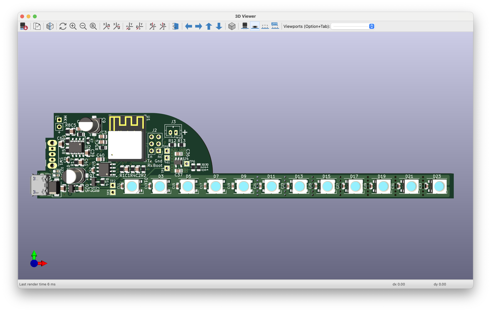
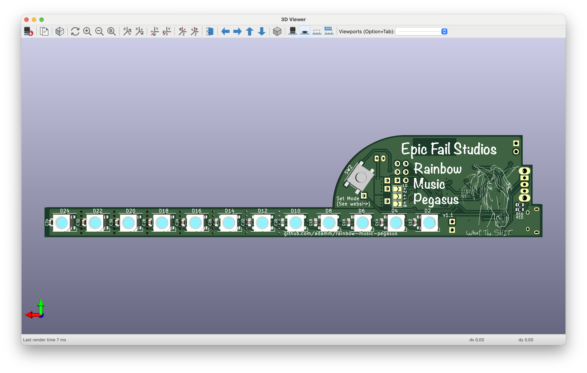

# Rainbow Music Pegasus

Disclaimer: This work is a *work-in-progress*.  This project is still under
active development and is estimated to be completed _Summer, 2024_.
What you see here is code that is largely incomplete, buggy, probably crashes,
and could catch fire. The PCB board is largely inefficient, expensive,
probably broken, and could catch fire.

## History

Version 1 of the rainbow-music-pegasus was completed March 2024.  A few
test units were sold at Breyer West show, but were never mass produced.
v1 lacks wifi, bluetooth, and battery support.

Version 1.1 is under active development, after adding on a battery and
charger module, battery status lights, and adjusting the position of the
LEDs.  It is estimated to be completed Summer 2024.

## Description

Rainbow Music Pegasus is a combination 3D printed horse coupled with a PCB
with 10 or more RGB lights, microphone, and a MCU.  A
[Fast Fourier transform](https://en.wikipedia.org/wiki/Fast_Fourier_transform)
algorithm tanslates an audio signal from the microphone, which is displayed
as a flashing colour light display as the horse's wings.

The original design from the horse is from Stlflix, but its internals were
not adequate to support the PCB.  As a result I completely remapped all
vertices, and designed the internal mount to hold the PCB unit vertically.

## Design

The PCB features an ESP32-C3 MCU, an OPA344 amplifier, and MCP73831 battery
charging circuit.

## Calibration

In order to isolate music from background ambient noise, a calibration
process needs to run at startup.  For 3 seconds after power-on, the wings
will appear to "flap" in white.  Once complete, start the music 

*Important*: If you're playing music during calibration, the music will be
ignored by the light display.  Pause your music and cycle the power, then
start the music when 3-second calibration is completed.

## Set Mode

v1.1 has a new "Set Mode" button.  The intention is to flip between
Music-listen and wifi or bluetooth mode.

*Important*: Development of the button has not yet started but plans to be
ready Summer 2024.

## TODO

- [X] Release v1 for Breyer West 2024
- [X] Listen to music
- [X] Interpret music signal into the light show
- [ ] Implement "Set Mode" button
- [ ] Add wifi support
- [ ] Add bluetooth support
- [X] Add battery support
- [ ] Release v1.1 for Breyer Fest 2024

